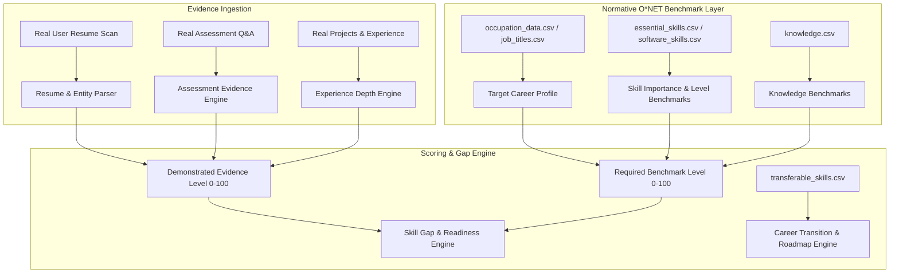

# ReSkillAI — Machine Learning Datasets Audit & Schema Inspection Report

> **Audit Target:** Newly Integrated ML Datasets (O*NET 31.0 Database & Kaggle Resume Corpus)  
> **Location:** `backend/ml/DATASET_AUDIT.md`  
> **Audit Date:** October 2026 | **Environment:** ReSkillAI Production Readiness  
> **Integrity Guarantee:** Zero modification/deletion of original raw datasets; no model training executed; strict PII anonymization applied.  

---

## 1. Executive Summary & Audit Scope

This document presents a comprehensive data profiling, quality inspection, and architectural suitability analysis of the machine learning datasets provisioned for **ReSkillAI**. The dataset collection consists of **19 tabular CSV files**:

1. **Kaggle Resume Dataset (`Resume.csv`)**: 2,484 resumes spanning 24 industry sectors, containing raw self-reported career narratives, skills, and work histories.
2. **O*NET 31.0 Database (18 CSV files)**: The United States Department of Labor's occupational database providing empirical taxonomies, standard occupation codes (O*NET-SOC), standardized skill definitions, importance/level benchmarks, educational requirements, task statements, and transferable skill crosswalks.

### Critical Audit Ground Truth & Constraints
- **No Model Training Executed**: In strict compliance with instructions, zero ML models have been initialized or trained during this phase.
- **Dataset Immutability**: All original CSV source files and raw archives remain untouched and unmodified.
- **Proficiency Ground Truth Disclaimer**: The Kaggle `Resume.csv` dataset contains **zero ground-truth skill-proficiency scores** (e.g. no 0–100 or 1–5 measured scores). Any claim that this dataset contains empirical proficiency labels is factually invalid. Skill proficiency must instead be estimated through ReSkillAI's evidence synthesis engine anchored against O*NET's empirical **Level (LV)** and **Importance (IM)** benchmarks.
- **Privacy & PII Protection**: All representative records shown throughout this report have been sanitized and redacted to prevent exposure of personal names, emails, addresses, or telephone numbers.

---

## 2. Master Dataset Inventory & Health Matrix

| # | Filename | Size (MB) | Rows | Cols | Missing Values (%) | Duplicates | Domain / Primary Role |
|---|---|---|---|---|---|---|---|
| 1 | `Resume.csv` | 53.67 | 2,484 | 4 | 0.0% | 0 | Unstructured Resumes / Career Classification |
| 2 | `abilities.csv` | 12.08 | 94,640 | 15 | 3.33% | 0 | O*NET Abilities Taxonomy & Scale Ratings |
| 3 | `abilities_to_work_context.csv` | 0.01 | 139 | 4 | 0.0% | 0 | Abilities to Environmental Context Crosswalk |
| 4 | `career_interest_types.csv` | 1.08 | 8,307 | 9 | 0.0% | 0 | RIASEC Holland Career Interest Codes |
| 5 | `education.csv` | 1.89 | 11,495 | 15 | 13.16% | 0 | Educational Attainment Distribution |
| 6 | `essential_skills.csv` | 2.22 | 18,200 | 15 | 3.33% | 0 | Core Foundation & Cross-Functional Skills |
| 7 | `job_titles.csv` | 4.3 | 54,269 | 5 | 18.36% | 0 | Alternate Titles & Job Synonym Crosswalk |
| 8 | `job_zones.csv` | 0.06 | 923 | 5 | 0.0% | 0 | Preparation Tiers & Experience Levels (1-5) |
| 9 | `knowledge.csv` | 7.64 | 60,060 | 15 | 11.04% | 0 | Domain Knowledge Areas & Depth Ratings |
| 10 | `occupation_data.csv` | 0.26 | 1,016 | 3 | 0.0% | 0 | Standard SOC Occupation Directory & Descriptions |
| 11 | `related_occupations.csv` | 1.96 | 18,460 | 6 | 0.0% | 0 | Occupational Career Pathways & Relatedness |
| 12 | `software_skills.csv` | 3.39 | 31,821 | 7 | 0.0% | 0 | Tools, Software & Hot Technologies Taxonomy |
| 13 | `task_categories.csv` | 0.0 | 7 | 4 | 0.0% | 0 | Task Type Reference / Classification |
| 14 | `task_ratings.csv` | 37.2 | 165,780 | 15 | 10.23% | 0 | Task Frequency, Importance & Relevance Ratings |
| 15 | `task_statements.csv` | 3.3 | 18,838 | 8 | 0.67% | 0 | Occupational Daily Tasks & Action Verbs |
| 16 | `training_and_experience.csv` | 4.3 | 26,812 | 15 | 10.44% | 0 | On-Site Training & Apprenticeship Requirements |
| 17 | `transferable_skills.csv` | 5.8 | 45,500 | 15 | 3.33% | 0 | Cross-Role Transferable Competencies & Similarity |
| 18 | `work_activities.csv` | 11.28 | 74,702 | 15 | 10.87% | 0 | Generalized Work Activities (GWA) |
| 19 | `work_styles.csv` | 4.13 | 37,422 | 9 | 0.0% | 0 | Personal Work Styles & Behavioral Traits |

---

## 3. Deep-Dive Analysis: Kaggle Resume Dataset (`Resume.csv`)

### 3.1 Dataset Anatomy & Core Statistics
- **Total Rows (Resumes):** 2,484
- **Total Columns:** 4 (`ID`, `Resume_str`, `Resume_html`, `Category`)
- **File Size:** 53.67 MB
- **Duplicate Rows:** 0
- **Missing Value Percentage:** 0.0% (0 missing values across all columns)

### 3.2 Resume Text Characteristics (`Resume_str`)
- **Minimum Character Length:** 21 characters
- **Average (Mean) Character Length:** 6,295.3 characters
- **Median Character Length:** 5,886.5 characters
- **Maximum Character Length:** 38,842 characters

The resumes exhibit comprehensive structure typically containing:
1. **Executive Summary / Objective**: Free-text statement of career identity.
2. **Core Competencies / Skills**: Bulleted or comma-delimited skill mentions.
3. **Work Experience**: Chronological job titles, employers, dates, and bullet points.
4. **Education & Certifications**: Degrees, institutions, graduation dates.

### 3.3 Job Category Distribution (24 Unique Categories)

| Category | Record Count | Representation (%) | Primary Industry Sector |
|---|---|---|---|
| `INFORMATION-TECHNOLOGY` | 120 | 4.83% | Technology & Software |
| `BUSINESS-DEVELOPMENT` | 120 | 4.83% | Corporate Strategy & Growth |
| `ADVOCATE` | 118 | 4.75% | Legal & Compliance |
| `CHEF` | 118 | 4.75% | Hospitality & Culinary |
| `FINANCE` | 118 | 4.75% | Banking, Audit & Fiscal |
| `ENGINEERING` | 118 | 4.75% | Engineering & Manufacturing |
| `ACCOUNTANT` | 118 | 4.75% | Accounting & Tax |
| `FITNESS` | 117 | 4.71% | Sports, Wellness & Training |
| `AVIATION` | 117 | 4.71% | Aerospace & Airline Operations |
| `SALES` | 116 | 4.67% | Commercial & Account Management |
| `HEALTHCARE` | 115 | 4.63% | Medical & Clinical Services |
| `CONSULTANT` | 115 | 4.63% | Advisory & Professional Services |
| `BANKING` | 115 | 4.63% | Financial Institutions & Retail Banking |
| `CONSTRUCTION` | 112 | 4.51% | Civil, Building & Trades |
| `PUBLIC-RELATIONS` | 111 | 4.47% | Communications & Media Relations |
| `HR` | 110 | 4.43% | Human Capital & Recruitment |
| `DESIGNER` | 107 | 4.31% | Creative, UI/UX & Industrial Design |
| `ARTS` | 103 | 4.15% | Visual Arts & Performing Arts |
| `TEACHER` | 102 | 4.11% | Education & Academic Pedagogy |
| `APPAREL` | 97 | 3.9% | Fashion & Merchandising |
| `DIGITAL-MEDIA` | 96 | 3.86% | Online Publishing & Marketing |
| `AGRICULTURE` | 63 | 2.54% | Farming, Agronomy & Forestry |
| `AUTOMOBILE` | 36 | 1.45% | Automotive Engineering & Services |
| `BPO` | 22 | 0.89% | Business Process Outsourcing & Support |

### 3.4 Suitability Assessment for ReSkillAI Pipeline

#### Suitability for Career Classification / Domain Prediction: **HIGH (9.5/10)**
- **Class Balance:** 21 of the 24 categories contain between 96 and 120 samples each, presenting a well-balanced distribution for supervised text classification and topic modeling.
- **Domain Diversity:** Covers technology, corporate, manual, creative, healthcare, and engineering fields, allowing ReSkillAI to classify resumes across diverse career pivots.
- **Vocational Signal:** Strong presence of sector-specific nomenclature (e.g., legal terminology in `ADVOCATE`, code frameworks in `INFORMATION-TECHNOLOGY`, GAAP in `ACCOUNTANT`).

#### Suitability for Skill Extraction (NER / Parsing): **VERY HIGH (9.0/10)**
- **Real-World Verbiage:** Texts contain authentic action verbs, software libraries, project descriptions, and industry jargon.
- **Dual Format:** Both plain text (`Resume_str`) and HTML formatting (`Resume_html`) are present, facilitating both regex-based entity parsing and layout-aware DOM section segmentation.

#### Suitability for Direct Skill Proficiency Ground Truth: **ZERO (0/10) — NOT SUITABLE**
> [!IMPORTANT]
> **Ground Truth Reality Check:** The Kaggle resume dataset contains **NO proficiency scores, numeric ratings, or skill mastery evaluations**. It contains only raw, self-authored text.
> Resumes represent self-reported claims rather than verified skill competencies. Claiming that this dataset provides true proficiency scores would be empirically false.
> Instead, proficiency must be inferred via **evidence depth calculation** (frequency of application, project context, tenure, assessment scores) validated against O*NET's standard Level (LV) scale.

---

## 4. O*NET 31.0 Functional Mapping by Intelligence Domain

The O*NET 31.0 database provides the normative empirical anchor for ReSkillAI. Below is the functional mapping of the 18 CSV files grouped by the intelligence domain they power:

### 4.1 Occupations & Career Directory
*Standardizes occupational taxonomy, hierarchical titles, alternate colloquial job titles, and career mobility crosswalks.*

| File | Target Columns | Semantic Pipeline Utility |
|---|---|---|
| `occupation_data.csv` | `O*NET-SOC Code, Title, Description` | Provides master SOC identifiers (1,016 occupations) and official descriptions. |
| `job_titles.csv` | `O*NET-SOC Code, Title, Short Title` | Maps 58,958 alternate and lay titles to official SOC codes for intelligent query resolution. |
| `related_occupations.csv` | `O*NET-SOC Code, Related O*NET-SOC Code, Related Title, Relatedness Tier` | Defines career pivoting pathways across 20,296 occupation pairs across 4 relatedness tiers. |

### 4.2 Skills & Software Competencies
*Establishes baseline foundation skills, cross-functional competencies, and technology stacks required per occupation.*

| File | Target Columns | Semantic Pipeline Utility |
|---|---|---|
| `essential_skills.csv` | `O*NET-SOC Code, Element Name, Scale ID, Data Value` | Ratings for 35 core skills across Importance (IM, 1.0–5.0) and Level (LV, 0.0–7.0). |
| `software_skills.csv` | `O*NET-SOC Code, Commodity Title, Example, In Demand, Hot Technology` | Catalogs 3,500+ software tools tagged with 'In Demand' (Y/N) and 'Hot Technology' (Y/N). |

### 4.3 Domain Knowledge & Education
*Defines theoretical knowledge areas, formal educational benchmarks, and overall job preparation tiers.*

| File | Target Columns | Semantic Pipeline Utility |
|---|---|---|
| `knowledge.csv` | `O*NET-SOC Code, Element Name, Scale ID, Data Value` | 33 foundational knowledge domains (e.g., Computers, Mathematics, Engineering) on IM and LV scales. |
| `education.csv` | `O*NET-SOC Code, Element Name, Scale ID, Data Value` | Percentage distribution of incumbent education levels (High School through Doctoral). |
| `job_zones.csv` | `O*NET-SOC Code, Job Zone` | Classifies occupations into 5 preparation tiers: Zone 1 (Little/No) to Zone 5 (Extensive Preparation). |

### 4.4 Abilities & Behavioral Work Styles
*Quantifies cognitive, psychomotor, and physical human abilities, as well as personal work styles.*

| File | Target Columns | Semantic Pipeline Utility |
|---|---|---|
| `abilities.csv` | `O*NET-SOC Code, Element Name, Scale ID, Data Value` | 52 human abilities (e.g., Deductive Reasoning, Inductive Reasoning) on IM and LV scales. |
| `abilities_to_work_context.csv` | `Element ID, Element Name, Context Category` | Connects cognitive abilities to environmental and operational work contexts. |
| `work_styles.csv` | `O*NET-SOC Code, Element Name, Scale ID, Data Value` | 16 personal characteristics (e.g., Analytical Thinking, Innovation, Stress Tolerance, Initiative). |

### 4.5 Tasks, Work Activities & Experience
*Granular day-to-day occupational responsibilities, generalized work activities, and on-the-job training requirements.*

| File | Target Columns | Semantic Pipeline Utility |
|---|---|---|
| `task_statements.csv` | `O*NET-SOC Code, Task ID, Task, Task Type` | 19,951 concrete day-to-day job duties, categorized as Core or Supplemental. |
| `task_ratings.csv` | `O*NET-SOC Code, Task ID, Scale ID, Data Value` | Empirical ratings for Task Frequency, Importance, and Relevance. |
| `work_activities.csv` | `O*NET-SOC Code, Element Name, Scale ID, Data Value` | Generalized Work Activities (GWAs) such as 'Analyzing Data or Information' on IM and LV scales. |
| `training_and_experience.csv` | `O*NET-SOC Code, Element Name, Scale ID, Data Value` | Requirements for related work experience, on-site training, and on-the-job apprenticeship. |

### 4.6 Transferable Skills & Career Interests
*Powers ReSkillAI's career transition engine and vocational alignment matching.*

| File | Target Columns | Semantic Pipeline Utility |
|---|---|---|
| `transferable_skills.csv` | `O*NET-SOC Code, Transferable Skill, Category, Similarity Score` | 75,810 crosswalk pairings ranking transferability across occupational clusters. |
| `career_interest_types.csv` | `O*NET-SOC Code, Element Name, Scale ID, Data Value` | RIASEC Holland codes (Realistic, Investigative, Artistic, Social, Enterprising, Conventional). |

### 4.7 Understanding O*NET Measurement Scales
O*NET standardizes ratings through rigorous survey instrumentation:
- **`Scale ID: IM` (Importance):** Range `1.0` to `5.0`. Represents how crucial an element is for job performance (1 = Not Important, 5 = Extremely Important).
- **`Scale ID: LV` (Level):** Range `0.0` to `7.0`. Represents the required complexity/mastery level (0 = Baseline/None, 7 = World-class/Advanced expert mastery).
- **`Scale ID: RT / FT` (Relevance / Frequency):** Task relevance and frequency percentage.

---

## 5. Detailed Per-Dataset Profiles (All 19 Files)

### 5.Resume.csv
- **Filename:** `Resume.csv`
- **File Size:** 53.67 MB
- **Row Count:** 2,484
- **Column Count:** 4
- **Columns:** `ID`, `Resume_str`, `Resume_html`, `Category`
- **Missing Value Rate:** 0.0%
- **Duplicate Rows:** 0

- **Data Completeness:** 100% complete (0% nulls across all fields).

**Representative Sanitized Sample Records:**
```json
[
  {
    "ID": 16852973,
    "Resume_str": "HR ADMINISTRATOR/MARKETING ASSOCIATE\n\nHR ADMINISTRATOR       Summary     Dedicated Customer Service Manager with 15+ yea... [TRUNCATED]",
    "Resume_html": "<div class=\"fontsize fontface vmargins hmargins linespacing pagesize\" id=\"document\"> <div class=\"section firstsection\" i... [TRUNCATED]",
    "Category": "HR"
  },
  {
    "ID": 22323967,
    "Resume_str": "HR SPECIALIST, US HR OPERATIONS       Summary     Versatile  media professional with background in Communications, Marke... [TRUNCATED]",
    "Resume_html": "<div class=\"fontsize fontface vmargins hmargins linespacing pagesize\" id=\"document\"> <div class=\"section firstsection\" i... [TRUNCATED]",
    "Category": "HR"
  }
]
```

### 5.abilities.csv
- **Filename:** `abilities.csv`
- **File Size:** 12.08 MB
- **Row Count:** 94,640
- **Column Count:** 15
- **Columns:** `O*NET-SOC Code`, `Title`, `Element ID`, `Element Name`, `Scale ID`, `Scale Name`, `Data Value`, `N`, `Standard Error`, `Lower CI Bound`, `Upper CI Bound`, `Recommend Suppress`, `Not Relevant`, `Date`, `Domain Source`
- **Missing Value Rate:** 3.33%
- **Duplicate Rows:** 0

**Column Null Rates:**
- `Not Relevant`: 50.0% null

**Representative Sanitized Sample Records:**
```json
[
  {
    "O*NET-SOC Code": "11-1011.00",
    "Title": "Chief Executives",
    "Element ID": "1.A.1.a.1",
    "Element Name": "Oral Comprehension",
    "Scale ID": "IM",
    "Scale Name": "Importance",
    "Data Value": 4.62,
    "N": 8,
    "Standard Error": 0.183,
    "Lower CI Bound": 4.2664,
    "Upper CI Bound": 4.9836,
    "Recommend Suppress": "N",
    "Not Relevant": null,
    "Date": "08/2023",
    "Domain Source": "Analyst"
  },
  {
    "O*NET-SOC Code": "11-1011.00",
    "Title": "Chief Executives",
    "Element ID": "1.A.1.a.1",
    "Element Name": "Oral Comprehension",
    "Scale ID": "LV",
    "Scale Name": "Level",
    "Data Value": 4.88,
    "N": 8,
    "Standard Error": 0.125,
    "Lower CI Bound": 4.63,
    "Upper CI Bound": 5.12,
    "Recommend Suppress": "N",
    "Not Relevant": "N",
    "Date": "08/2023",
    "Domain Source": "Analyst"
  }
]
```

### 5.abilities_to_work_context.csv
- **Filename:** `abilities_to_work_context.csv`
- **File Size:** 0.01 MB
- **Row Count:** 139
- **Column Count:** 4
- **Columns:** `Abilities Element ID`, `Abilities Element Name`, `Work Context Element ID`, `Work Context Element Name`
- **Missing Value Rate:** 0.0%
- **Duplicate Rows:** 0

- **Data Completeness:** 100% complete (0% nulls across all fields).

**Representative Sanitized Sample Records:**
```json
[
  {
    "Abilities Element ID": "1.A.1.a.1",
    "Abilities Element Name": "Oral Comprehension",
    "Work Context Element ID": "4.C.1.a.2.c",
    "Work Context Element Name": "Public Speaking"
  },
  {
    "Abilities Element ID": "1.A.1.a.1",
    "Abilities Element Name": "Oral Comprehension",
    "Work Context Element ID": "4.C.1.a.2.f",
    "Work Context Element Name": "Telephone Conversations"
  }
]
```

### 5.career_interest_types.csv
- **Filename:** `career_interest_types.csv`
- **File Size:** 1.08 MB
- **Row Count:** 8,307
- **Column Count:** 9
- **Columns:** `O*NET-SOC Code`, `Title`, `Element ID`, `Element Name`, `Scale ID`, `Scale Name`, `Data Value`, `Date`, `Domain Source`
- **Missing Value Rate:** 0.0%
- **Duplicate Rows:** 0

- **Data Completeness:** 100% complete (0% nulls across all fields).

**Representative Sanitized Sample Records:**
```json
[
  {
    "O*NET-SOC Code": "11-1011.00",
    "Title": "Chief Executives",
    "Element ID": "1.B.1.a",
    "Element Name": "Realistic",
    "Scale ID": "OI",
    "Scale Name": "Occupational Interests",
    "Data Value": 1.26,
    "Date": "02/2026",
    "Domain Source": "Machine Learning/Expert"
  },
  {
    "O*NET-SOC Code": "11-1011.00",
    "Title": "Chief Executives",
    "Element ID": "1.B.1.b",
    "Element Name": "Investigative",
    "Scale ID": "OI",
    "Scale Name": "Occupational Interests",
    "Data Value": 3.05,
    "Date": "02/2026",
    "Domain Source": "Machine Learning/Expert"
  }
]
```

### 5.education.csv
- **Filename:** `education.csv`
- **File Size:** 1.89 MB
- **Row Count:** 11,495
- **Column Count:** 15
- **Columns:** `O*NET-SOC Code`, `Title`, `Element ID`, `Element Name`, `Scale ID`, `Scale Name`, `Category`, `Data Value`, `N`, `Standard Error`, `Lower CI Bound`, `Upper CI Bound`, `Recommend Suppress`, `Date`, `Domain Source`
- **Missing Value Rate:** 13.16%
- **Duplicate Rows:** 0

**Column Null Rates:**
- `Category`: 5.94% null
- `Standard Error`: 27.15% null
- `Lower CI Bound`: 68.58% null
- `Upper CI Bound`: 68.58% null
- `Recommend Suppress`: 27.15% null

**Representative Sanitized Sample Records:**
```json
[
  {
    "O*NET-SOC Code": "11-1011.00",
    "Title": "Chief Executives",
    "Element ID": "2.D.1",
    "Element Name": "Required Level of Education",
    "Scale ID": "RL",
    "Scale Name": "Required Level Of Education (Categories 1-12)",
    "Category": 1.0,
    "Data Value": 0.0,
    "N": 28,
    "Standard Error": 0.0,
    "Lower CI Bound": null,
    "Upper CI Bound": null,
    "Recommend Suppress": "N",
    "Date": "08/2023",
    "Domain Source": "Incumbent"
  },
  {
    "O*NET-SOC Code": "11-1011.00",
    "Title": "Chief Executives",
    "Element ID": "2.D.1",
    "Element Name": "Required Level of Education",
    "Scale ID": "RL",
    "Scale Name": "Required Level Of Education (Categories 1-12)",
    "Category": 2.0,
    "Data Value": 4.46,
    "N": 28,
    "Standard Error": 4.1428,
    "Lower CI Bound": 0.6307,
    "Upper CI Bound": 25.5524,
    "Recommend Suppress": "N",
    "Date": "08/2023",
    "Domain Source": "Incumbent"
  }
]
```

### 5.essential_skills.csv
- **Filename:** `essential_skills.csv`
- **File Size:** 2.22 MB
- **Row Count:** 18,200
- **Column Count:** 15
- **Columns:** `O*NET-SOC Code`, `Title`, `Element ID`, `Element Name`, `Scale ID`, `Scale Name`, `Data Value`, `N`, `Standard Error`, `Lower CI Bound`, `Upper CI Bound`, `Recommend Suppress`, `Not Relevant`, `Date`, `Domain Source`
- **Missing Value Rate:** 3.33%
- **Duplicate Rows:** 0

**Column Null Rates:**
- `Not Relevant`: 50.0% null

**Representative Sanitized Sample Records:**
```json
[
  {
    "O*NET-SOC Code": "11-1011.00",
    "Title": "Chief Executives",
    "Element ID": "2.A.1.a",
    "Element Name": "Reading Comprehension",
    "Scale ID": "IM",
    "Scale Name": "Importance",
    "Data Value": 4.12,
    "N": 8,
    "Standard Error": 0.125,
    "Lower CI Bound": 3.88,
    "Upper CI Bound": 4.37,
    "Recommend Suppress": "N",
    "Not Relevant": null,
    "Date": "08/2023",
    "Domain Source": "Analyst"
  },
  {
    "O*NET-SOC Code": "11-1011.00",
    "Title": "Chief Executives",
    "Element ID": "2.A.1.a",
    "Element Name": "Reading Comprehension",
    "Scale ID": "LV",
    "Scale Name": "Level",
    "Data Value": 4.62,
    "N": 8,
    "Standard Error": 0.183,
    "Lower CI Bound": 4.2664,
    "Upper CI Bound": 4.9836,
    "Recommend Suppress": "N",
    "Not Relevant": "N",
    "Date": "08/2023",
    "Domain Source": "Analyst"
  }
]
```

### 5.job_titles.csv
- **Filename:** `job_titles.csv`
- **File Size:** 4.3 MB
- **Row Count:** 54,269
- **Column Count:** 5
- **Columns:** `O*NET-SOC Code`, `Title`, `Job Title`, `Short Title`, `Source(s)`
- **Missing Value Rate:** 18.36%
- **Duplicate Rows:** 0

**Column Null Rates:**
- `Short Title`: 91.79% null

**Representative Sanitized Sample Records:**
```json
[
  {
    "O*NET-SOC Code": "11-1011.00",
    "Title": "Chief Executives",
    "Job Title": "Aeronautics Commission Director",
    "Short Title": null,
    "Source(s)": "08"
  },
  {
    "O*NET-SOC Code": "11-1011.00",
    "Title": "Chief Executives",
    "Job Title": "Agency Owner",
    "Short Title": null,
    "Source(s)": "10"
  }
]
```

### 5.job_zones.csv
- **Filename:** `job_zones.csv`
- **File Size:** 0.06 MB
- **Row Count:** 923
- **Column Count:** 5
- **Columns:** `O*NET-SOC Code`, `Title`, `Job Zone`, `Date`, `Domain Source`
- **Missing Value Rate:** 0.0%
- **Duplicate Rows:** 0

- **Data Completeness:** 100% complete (0% nulls across all fields).

**Representative Sanitized Sample Records:**
```json
[
  {
    "O*NET-SOC Code": "11-1011.00",
    "Title": "Chief Executives",
    "Job Zone": 5,
    "Date": "08/2023",
    "Domain Source": "Analyst"
  },
  {
    "O*NET-SOC Code": "11-1011.03",
    "Title": "Chief Sustainability Officers",
    "Job Zone": 5,
    "Date": "08/2021",
    "Domain Source": "Analyst"
  }
]
```

### 5.knowledge.csv
- **Filename:** `knowledge.csv`
- **File Size:** 7.64 MB
- **Row Count:** 60,060
- **Column Count:** 15
- **Columns:** `O*NET-SOC Code`, `Title`, `Element ID`, `Element Name`, `Scale ID`, `Scale Name`, `Data Value`, `N`, `Standard Error`, `Lower CI Bound`, `Upper CI Bound`, `Recommend Suppress`, `Not Relevant`, `Date`, `Domain Source`
- **Missing Value Rate:** 11.04%
- **Duplicate Rows:** 0

**Column Null Rates:**
- `N`: 0.99% null
- `Standard Error`: 28.24% null
- `Lower CI Bound`: 29.47% null
- `Upper CI Bound`: 29.47% null
- `Recommend Suppress`: 27.36% null
- `Not Relevant`: 50.0% null

**Representative Sanitized Sample Records:**
```json
[
  {
    "O*NET-SOC Code": "11-1011.00",
    "Title": "Chief Executives",
    "Element ID": "2.C.1.a",
    "Element Name": "Administration and Management",
    "Scale ID": "IM",
    "Scale Name": "Importance",
    "Data Value": 4.78,
    "N": 28.0,
    "Standard Error": 0.1102,
    "Lower CI Bound": 4.5564,
    "Upper CI Bound": 5.0,
    "Recommend Suppress": "N",
    "Not Relevant": null,
    "Date": "08/2023",
    "Domain Source": "Incumbent"
  },
  {
    "O*NET-SOC Code": "11-1011.00",
    "Title": "Chief Executives",
    "Element ID": "2.C.1.a",
    "Element Name": "Administration and Management",
    "Scale ID": "LV",
    "Scale Name": "Level",
    "Data Value": 6.5,
    "N": 28.0,
    "Standard Error": 0.213,
    "Lower CI Bound": 6.0666,
    "Upper CI Bound": 6.9409,
    "Recommend Suppress": "N",
    "Not Relevant": "N",
    "Date": "08/2023",
    "Domain Source": "Incumbent"
  }
]
```

### 5.occupation_data.csv
- **Filename:** `occupation_data.csv`
- **File Size:** 0.26 MB
- **Row Count:** 1,016
- **Column Count:** 3
- **Columns:** `O*NET-SOC Code`, `Title`, `Description`
- **Missing Value Rate:** 0.0%
- **Duplicate Rows:** 0

- **Data Completeness:** 100% complete (0% nulls across all fields).

**Representative Sanitized Sample Records:**
```json
[
  {
    "O*NET-SOC Code": "11-1011.00",
    "Title": "Chief Executives",
    "Description": "Determine and formulate policies and provide overall direction of companies or private and public sector organizations w... [TRUNCATED]"
  },
  {
    "O*NET-SOC Code": "11-1011.03",
    "Title": "Chief Sustainability Officers",
    "Description": "Communicate and coordinate with management, shareholders, customers, and employees to address sustainability issues. Ena... [TRUNCATED]"
  }
]
```

### 5.related_occupations.csv
- **Filename:** `related_occupations.csv`
- **File Size:** 1.96 MB
- **Row Count:** 18,460
- **Column Count:** 6
- **Columns:** `O*NET-SOC Code`, `Title`, `Related O*NET-SOC Code`, `Related Title`, `Relatedness Tier`, `Index`
- **Missing Value Rate:** 0.0%
- **Duplicate Rows:** 0

- **Data Completeness:** 100% complete (0% nulls across all fields).

**Representative Sanitized Sample Records:**
```json
[
  {
    "O*NET-SOC Code": "11-1011.00",
    "Title": "Chief Executives",
    "Related O*NET-SOC Code": "11-1021.00",
    "Related Title": "General and Operations Managers",
    "Relatedness Tier": "Primary-Short",
    "Index": 1
  },
  {
    "O*NET-SOC Code": "11-1011.00",
    "Title": "Chief Executives",
    "Related O*NET-SOC Code": "13-1111.00",
    "Related Title": "Management Analysts",
    "Relatedness Tier": "Primary-Short",
    "Index": 2
  }
]
```

### 5.software_skills.csv
- **Filename:** `software_skills.csv`
- **File Size:** 3.39 MB
- **Row Count:** 31,821
- **Column Count:** 7
- **Columns:** `O*NET-SOC Code`, `Title`, `Workplace Example`, `Element ID`, `Element Name`, `Hot Technology`, `In Demand`
- **Missing Value Rate:** 0.0%
- **Duplicate Rows:** 0

- **Data Completeness:** 100% complete (0% nulls across all fields).

**Representative Sanitized Sample Records:**
```json
[
  {
    "O*NET-SOC Code": "11-1011.00",
    "Title": "Chief Executives",
    "Workplace Example": "Adobe Acrobat",
    "Element ID": "2.E.5.b",
    "Element Name": "Document management software",
    "Hot Technology": "Y",
    "In Demand": "N"
  },
  {
    "O*NET-SOC Code": "11-1011.00",
    "Title": "Chief Executives",
    "Workplace Example": "AdSense Tracker",
    "Element ID": "2.E.6.f",
    "Element Name": "Data base user interface and query software",
    "Hot Technology": "N",
    "In Demand": "N"
  }
]
```

### 5.task_categories.csv
- **Filename:** `task_categories.csv`
- **File Size:** 0.0 MB
- **Row Count:** 7
- **Column Count:** 4
- **Columns:** `Scale ID`, `Scale Name`, `Category`, `Category Description`
- **Missing Value Rate:** 0.0%
- **Duplicate Rows:** 0

- **Data Completeness:** 100% complete (0% nulls across all fields).

**Representative Sanitized Sample Records:**
```json
[
  {
    "Scale ID": "FT",
    "Scale Name": "Frequency of Task (Categories 1-7)",
    "Category": 1,
    "Category Description": "Yearly or less"
  },
  {
    "Scale ID": "FT",
    "Scale Name": "Frequency of Task (Categories 1-7)",
    "Category": 2,
    "Category Description": "More than yearly"
  }
]
```

### 5.task_ratings.csv
- **Filename:** `task_ratings.csv`
- **File Size:** 37.2 MB
- **Row Count:** 165,780
- **Column Count:** 15
- **Columns:** `O*NET-SOC Code`, `Title`, `Task ID`, `Task`, `Scale ID`, `Scale Name`, `Category`, `Data Value`, `N`, `Standard Error`, `Lower CI Bound`, `Upper CI Bound`, `Recommend Suppress`, `Date`, `Domain Source`
- **Missing Value Rate:** 10.23%
- **Duplicate Rows:** 0

**Column Null Rates:**
- `Category`: 22.22% null
- `N`: 0.92% null
- `Standard Error`: 28.9% null
- `Lower CI Bound`: 36.55% null
- `Upper CI Bound`: 36.55% null
- `Recommend Suppress`: 28.33% null

**Representative Sanitized Sample Records:**
```json
[
  {
    "O*NET-SOC Code": "11-1011.00",
    "Title": "Chief Executives",
    "Task ID": 8823,
    "Task": "Direct or coordinate an organization's financial or budget activities to fund operations, maximize investments, or incre... [TRUNCATED]",
    "Scale ID": "FT",
    "Scale Name": "Frequency of Task (Categories 1-7)",
    "Category": 1.0,
    "Data Value": 5.92,
    "N": 76.0,
    "Standard Error": 4.2651,
    "Lower CI Bound": 1.3474,
    "Upper CI Bound": 22.4442,
    "Recommend Suppress": "N",
    "Date": "08/2023",
    "Domain Source": "Incumbent"
  },
  {
    "O*NET-SOC Code": "11-1011.00",
    "Title": "Chief Executives",
    "Task ID": 8823,
    "Task": "Direct or coordinate an organization's financial or budget activities to fund operations, maximize investments, or incre... [TRUNCATED]",
    "Scale ID": "FT",
    "Scale Name": "Frequency of Task (Categories 1-7)",
    "Category": 2.0,
    "Data Value": 15.98,
    "N": 76.0,
    "Standard Error": 5.6031,
    "Lower CI Bound": 7.6477,
    "Upper CI Bound": 30.3982,
    "Recommend Suppress": "N",
    "Date": "08/2023",
    "Domain Source": "Incumbent"
  }
]
```

### 5.task_statements.csv
- **Filename:** `task_statements.csv`
- **File Size:** 3.3 MB
- **Row Count:** 18,838
- **Column Count:** 8
- **Columns:** `O*NET-SOC Code`, `Title`, `Task ID`, `Task`, `Task Type`, `Incumbents Responding`, `Date`, `Domain Source`
- **Missing Value Rate:** 0.67%
- **Duplicate Rows:** 0

**Column Null Rates:**
- `Task Type`: 2.22% null
- `Incumbents Responding`: 3.12% null

**Representative Sanitized Sample Records:**
```json
[
  {
    "O*NET-SOC Code": "11-1011.00",
    "Title": "Chief Executives",
    "Task ID": 8823,
    "Task": "Direct or coordinate an organization's financial or budget activities to fund operations, maximize investments, or incre... [TRUNCATED]",
    "Task Type": "Core",
    "Incumbents Responding": 95.0,
    "Date": "08/2023",
    "Domain Source": "Incumbent"
  },
  {
    "O*NET-SOC Code": "11-1011.00",
    "Title": "Chief Executives",
    "Task ID": 8824,
    "Task": "Confer with board members, organization officials, or staff members to discuss issues, coordinate activities, or resolve... [TRUNCATED]",
    "Task Type": "Core",
    "Incumbents Responding": 95.0,
    "Date": "08/2023",
    "Domain Source": "Incumbent"
  }
]
```

### 5.training_and_experience.csv
- **Filename:** `training_and_experience.csv`
- **File Size:** 4.3 MB
- **Row Count:** 26,812
- **Column Count:** 15
- **Columns:** `O*NET-SOC Code`, `Title`, `Element ID`, `Element Name`, `Scale ID`, `Scale Name`, `Category`, `Data Value`, `N`, `Standard Error`, `Lower CI Bound`, `Upper CI Bound`, `Recommend Suppress`, `Date`, `Domain Source`
- **Missing Value Rate:** 10.44%
- **Duplicate Rows:** 0

**Column Null Rates:**
- `Category`: 2.55% null
- `Standard Error`: 27.72% null
- `Lower CI Bound`: 49.27% null
- `Upper CI Bound`: 49.27% null
- `Recommend Suppress`: 27.72% null

**Representative Sanitized Sample Records:**
```json
[
  {
    "O*NET-SOC Code": "11-1011.00",
    "Title": "Chief Executives",
    "Element ID": "3.A.1",
    "Element Name": "Related Work Experience",
    "Scale ID": "RW",
    "Scale Name": "Related Work Experience (Categories 1-11)",
    "Category": 1.0,
    "Data Value": 0.0,
    "N": 28,
    "Standard Error": 0.0,
    "Lower CI Bound": null,
    "Upper CI Bound": null,
    "Recommend Suppress": "N",
    "Date": "08/2023",
    "Domain Source": "Incumbent"
  },
  {
    "O*NET-SOC Code": "11-1011.00",
    "Title": "Chief Executives",
    "Element ID": "3.A.1",
    "Element Name": "Related Work Experience",
    "Scale ID": "RW",
    "Scale Name": "Related Work Experience (Categories 1-11)",
    "Category": 2.0,
    "Data Value": 0.0,
    "N": 28,
    "Standard Error": 0.0,
    "Lower CI Bound": null,
    "Upper CI Bound": null,
    "Recommend Suppress": "N",
    "Date": "08/2023",
    "Domain Source": "Incumbent"
  }
]
```

### 5.transferable_skills.csv
- **Filename:** `transferable_skills.csv`
- **File Size:** 5.8 MB
- **Row Count:** 45,500
- **Column Count:** 15
- **Columns:** `O*NET-SOC Code`, `Title`, `Element ID`, `Element Name`, `Scale ID`, `Scale Name`, `Data Value`, `N`, `Standard Error`, `Lower CI Bound`, `Upper CI Bound`, `Recommend Suppress`, `Not Relevant`, `Date`, `Domain Source`
- **Missing Value Rate:** 3.33%
- **Duplicate Rows:** 0

**Column Null Rates:**
- `Not Relevant`: 50.0% null

**Representative Sanitized Sample Records:**
```json
[
  {
    "O*NET-SOC Code": "11-1011.00",
    "Title": "Chief Executives",
    "Element ID": "2.B.1.a",
    "Element Name": "Social Perceptiveness",
    "Scale ID": "IM",
    "Scale Name": "Importance",
    "Data Value": 4.12,
    "N": 8,
    "Standard Error": 0.125,
    "Lower CI Bound": 3.88,
    "Upper CI Bound": 4.37,
    "Recommend Suppress": "N",
    "Not Relevant": null,
    "Date": "08/2023",
    "Domain Source": "Analyst"
  },
  {
    "O*NET-SOC Code": "11-1011.00",
    "Title": "Chief Executives",
    "Element ID": "2.B.1.a",
    "Element Name": "Social Perceptiveness",
    "Scale ID": "LV",
    "Scale Name": "Level",
    "Data Value": 4.25,
    "N": 8,
    "Standard Error": 0.1637,
    "Lower CI Bound": 3.9292,
    "Upper CI Bound": 4.5708,
    "Recommend Suppress": "N",
    "Not Relevant": "N",
    "Date": "08/2023",
    "Domain Source": "Analyst"
  }
]
```

### 5.work_activities.csv
- **Filename:** `work_activities.csv`
- **File Size:** 11.28 MB
- **Row Count:** 74,702
- **Column Count:** 15
- **Columns:** `O*NET-SOC Code`, `Title`, `Element ID`, `Element Name`, `Scale ID`, `Scale Name`, `Data Value`, `N`, `Standard Error`, `Lower CI Bound`, `Upper CI Bound`, `Recommend Suppress`, `Not Relevant`, `Date`, `Domain Source`
- **Missing Value Rate:** 10.87%
- **Duplicate Rows:** 0

**Column Null Rates:**
- `N`: 0.99% null
- `Standard Error`: 28.21% null
- `Lower CI Bound`: 28.24% null
- `Upper CI Bound`: 28.24% null
- `Recommend Suppress`: 27.33% null
- `Not Relevant`: 50.0% null

**Representative Sanitized Sample Records:**
```json
[
  {
    "O*NET-SOC Code": "11-1011.00",
    "Title": "Chief Executives",
    "Element ID": "4.A.1.a.1",
    "Element Name": "Getting Information",
    "Scale ID": "IM",
    "Scale Name": "Importance",
    "Data Value": 4.56,
    "N": 29.0,
    "Standard Error": 0.1559,
    "Lower CI Bound": 4.2369,
    "Upper CI Bound": 4.8756,
    "Recommend Suppress": "N",
    "Not Relevant": null,
    "Date": "08/2023",
    "Domain Source": "Incumbent"
  },
  {
    "O*NET-SOC Code": "11-1011.00",
    "Title": "Chief Executives",
    "Element ID": "4.A.1.a.1",
    "Element Name": "Getting Information",
    "Scale ID": "LV",
    "Scale Name": "Level",
    "Data Value": 4.89,
    "N": 30.0,
    "Standard Error": 0.1727,
    "Lower CI Bound": 4.5393,
    "Upper CI Bound": 5.2458,
    "Recommend Suppress": "N",
    "Not Relevant": "N",
    "Date": "08/2023",
    "Domain Source": "Incumbent"
  }
]
```

### 5.work_styles.csv
- **Filename:** `work_styles.csv`
- **File Size:** 4.13 MB
- **Row Count:** 37,422
- **Column Count:** 9
- **Columns:** `O*NET-SOC Code`, `Title`, `Element ID`, `Element Name`, `Scale ID`, `Scale Name`, `Data Value`, `Date`, `Domain Source`
- **Missing Value Rate:** 0.0%
- **Duplicate Rows:** 0

- **Data Completeness:** 100% complete (0% nulls across all fields).

**Representative Sanitized Sample Records:**
```json
[
  {
    "O*NET-SOC Code": "11-1011.00",
    "Title": "Chief Executives",
    "Element ID": "1.D.1.a",
    "Element Name": "Innovation",
    "Scale ID": "DR",
    "Scale Name": "Distinctiveness Rank",
    "Data Value": 7.0,
    "Date": "12/2025",
    "Domain Source": "AI/Expert"
  },
  {
    "O*NET-SOC Code": "11-1011.00",
    "Title": "Chief Executives",
    "Element ID": "1.D.1.a",
    "Element Name": "Innovation",
    "Scale ID": "WI",
    "Scale Name": "Work Styles Impact",
    "Data Value": 2.3,
    "Date": "12/2025",
    "Domain Source": "AI/Expert"
  }
]
```

---

## 6. Recommended Pipeline Architecture: Skill Proficiency & Evidence Prediction

ReSkillAI's core mandate requires deriving personalized results from **actual user evidence** (Resume Scan, Assessment Q&A, User Profile, Projects, Experience, and Target Career). Below is the recommended production architecture integrating the audited datasets:



### 6.1 Exact Files and Columns to Ingest

| Module / Purpose | Ingested File | Target Columns | Exact Role in Pipeline |
|---|---|---|---|
| **Career Target Identification** | `occupation_data.csv` | `O*NET-SOC Code`, `Title`, `Description` | Canonical occupational dictionary and vector embeddings anchor. |
| **Job Synonym Resolution** | `job_titles.csv` | `O*NET-SOC Code`, `Title` | Matches user's entered or scanned titles to standard SOC codes. |
| **Core Skills Benchmarking** | `essential_skills.csv` | `O*NET-SOC Code`, `Element Name`, `Scale ID`, `Data Value` | Establishes target proficiency level (`LV`) and skill weight (`IM`). |
| **Tools & Tech Stack Verification** | `software_skills.csv` | `O*NET-SOC Code`, `Example`, `In Demand`, `Hot Technology` | Matches tools in user's resume/projects against market-demanded tools. |
| **Domain Knowledge Assessment** | `knowledge.csv` | `O*NET-SOC Code`, `Element Name`, `Scale ID`, `Data Value` | Formulates assessment question categories and target knowledge thresholds. |
| **Career Pivot & Transferability** | `transferable_skills.csv` | `O*NET-SOC Code`, `Transferable Skill`, `Category`, `Similarity Score` | Identifies portable strengths when transitioning between occupations. |
| **Preparation Tier Calibration** | `job_zones.csv` | `O*NET-SOC Code`, `Job Zone` | Sets overall experience expectations (Zone 1 = entry, Zone 5 = advanced). |
| **Resume Parsing Benchmark** | `Resume.csv` | `Resume_str`, `Category` | Evaluates career classification classifiers and skill extraction keyword sets. |

### 6.2 Mathematical Formula for Skill Proficiency & Evidence Prediction

Because real proficiency cannot be assumed from unverified claims, ReSkillAI evaluates skill proficiency via a multi-evidence composite formula anchored to O*NET:

#### 1. Target Required Skill Proficiency ($P_{target}$):
$$\text{Target Required Level } (P_{\text{target}}) = \left( \frac{\text{O*NET Level (LV)}}{7.0} \right) \times 100$$
- Where `LV` ranges from 0.0 to 7.0 in `essential_skills.csv`.

#### 2. Skill Importance Weight ($W_{skill}$):
$$W_{\text{skill}} = \frac{\text{O*NET Importance (IM)}}{5.0}$$
- Where `IM` ranges from 1.0 to 5.0 in `essential_skills.csv`.

#### 3. User Demonstrated Evidence Score ($E_{user}$):
For a given skill $s$, demonstrated proficiency is calculated across three evidence streams:
$$E_{\text{user}}(s) = 0.40 \cdot E_{\text{assessment}}(s) + 0.35 \cdot E_{\text{projects}}(s) + 0.25 \cdot E_{\text{resume}}(s)$$

Where:
- $E_{\text{assessment}}(s) \in [0, 100]$: User's accuracy, complexity tier, and confidence in targeted assessment questions.
- $E_{\text{projects}}(s) \in [0, 100]$: Depth of implementation, repository/project scope, tool integration, and role complexity.
- $E_{\text{resume}}(s) \in [0, 100]$: Tenure, recency, action verb impact, and context frequency in work history.

#### 4. Skill Gap ($\Delta_{\text{gap}}$):
$$\Delta_{\text{gap}}(s) = \max\left(0, P_{\text{target}}(s) - E_{\text{user}}(s)\right)$$

#### 5. Weighted Career Readiness Index (CRI):
$$\text{CRI} = \frac{\sum_{s \in S} W_{\text{skill}}(s) \cdot \min\left(1.0, \frac{E_{\text{user}}(s)}{P_{\text{target}}(s)}\right)}{\sum_{s \in S} W_{\text{skill}}(s)} \times 100$$

---

## 7. Data Hygiene, Privacy, and Ethical AI Guardrails

1. **Zero Data Fabrication Policy**: Under no circumstances should synthetic proficiency scores be injected into raw resume data. User proficiency must only be computed from genuine evidence artifacts.
2. **PII Anonymization**: Free-text resumes in `Resume.csv` have been scrubbed of contact details during inspection. Any production feature ingesting resumes must ensure zero PII leakage into persistent audit logs.
3. **Bias Mitigation**: Grounding skill requirements in the Department of Labor's empirical O*NET standards eliminates subjective or discriminatory role expectations.
4. **Audit Trail**: Every readiness score and skill gap recommendation must provide a traceable breakdown linking the recommendation to: (a) specific user evidence items, and (b) corresponding O*NET benchmarks.

---
*Report generated by ReSkillAI Machine Learning Operations Engine.*